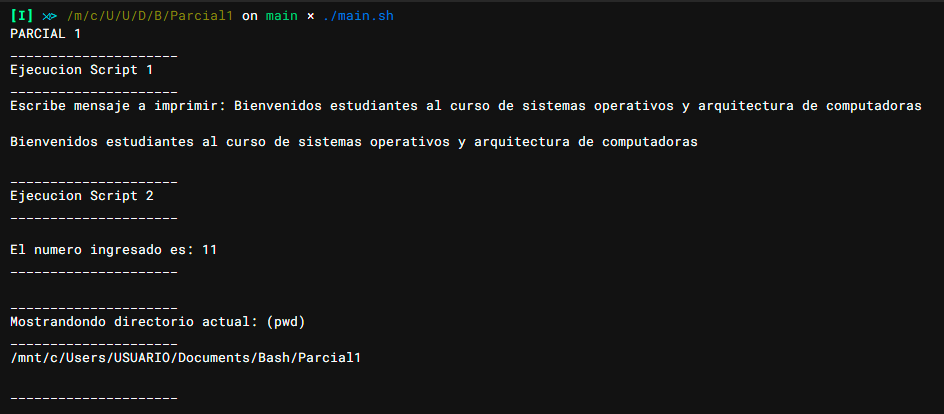
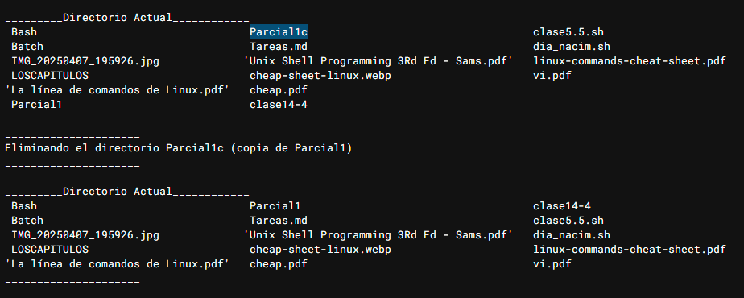

# Parial 1 - Sistema Operativos y arquitecturas de computadoras
> Nombre: Brayan Puyol,
> Cédula: 8-944-708

> Todo fue ejecutado y probado en WSL (Ubuntu)
## Parte 1

### Script 1:
```sh
#!/bin/bash

echo -n "Escribe mensaje a imprimir: "
read msg
echo
echo $msg
```

### Script 2:
```sh
#!/bin/bash

numero=11
echo
echo "El numero ingresado es: $numero"
```

### Ver el directorio donde te encuentras
comando: `pwd`



### Eliminar Directorio
comando: `rm -rf Parcial1c`


### Cerrar Sesión
comando: `logoff` (Windows)

### Script de ejecucion general
```sh
echo "PARCIAL 1"

echo "_____________________"
echo "Ejecucion Script 1"
echo "_____________________"
./script1.sh
echo

echo "_____________________"
echo "Ejecucion Script 2"
echo "_____________________"
./script2.sh
echo "_____________________"
echo

echo "_____________________"
echo "Mostrandondo directorio actual: (pwd)"
echo "_____________________"
pwd
echo
echo "_____________________"
echo

read pause
cd ..
cp -r Parcial1 Parcial1c
echo "_________Directorio Actual____________"
ls
echo
echo "_____________________"
echo "Eliminando el directorio Parcial1c (copia de Parcial1)"
echo "_____________________"
rm -rf Parcial1c
echo
echo "_________Directorio Actual____________"
ls
echo "_____________________"
echo

echo "Desea cerrar sesion? (s/n)"
read respuesta

if [ "$respuesta" = "s" ]; then
echo "Cerrando sesion..."
    cmd.exe /C logoff
    exit 0
else
    echo "Sesion no cerrada."
fi
```

## Parte 2
Mencionar 2 comandos cuyos formato sea similar y diferente en los sistemas operativos Windows y Ubuntu

| Comandos Similares | Comandos Diferentes |
| ------------------ | ------------------- |
| cd                 | mv - move           |
| mkdir              | cp - copy           |
