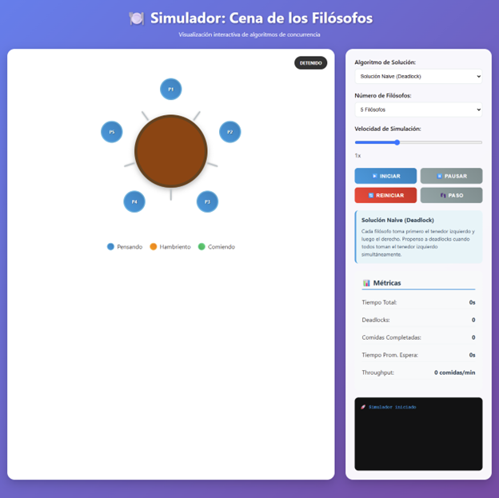
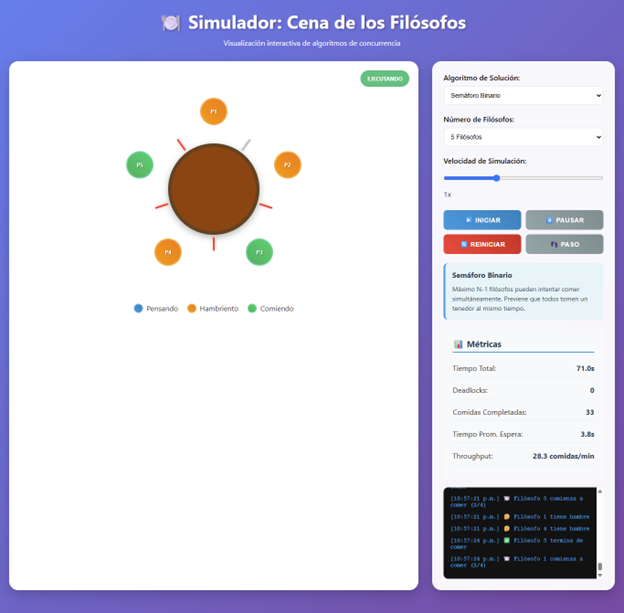

<div style="text-align: justify;">

# Simulador: Cena de los Filósofos

## Recursos

Video demostrativo del funcionamiento: [YouTube](https://youtu.be/ugK83Pab84I)

Código del programa: [GitHub](https://github.com/UzzielSW/Bash/tree/main/SO/Parcial2)

---

## Introducción

Este proyecto implementa un simulador interactivo del clásico problema de concurrencia conocido como "La Cena de los Filósofos". El simulador permite visualizar y comparar diferentes algoritmos de solución, demostrando cómo cada uno maneja la sincronización entre procesos y previene condiciones de carrera y deadlocks.

## El Problema de la Cena de los Filósofos

### Contexto Original

- **N filósofos** se sientan alrededor de una mesa circular
- Cada filósofo tiene **un tenedor a su izquierda y otro a su derecha**
- Para comer, un filósofo necesita **ambos tenedores simultáneamente**
- Los filósofos alternan entre **pensar** y **comer**

### Problemas de Concurrencia

1. **Condición de Carrera**: Múltiples filósofos intentando tomar los mismos tenedores
2. **Deadlock**: Todos los filósofos toman su tenedor izquierdo y esperan indefinidamente el derecho
3. **Inanición**: Algunos filósofos pueden no comer nunca debido a la distribución de recursos

## Algoritmos Implementados

### 1. Solución Naive (Deadlock)

```javascript
// Lógica básica - propensa a deadlocks
if (this.states[i] === "hungry") {
  if (!this.forkStates[leftFork] && !this.forkStates[rightFork]) {
    this.forkStates[leftFork] = true;
    this.forkStates[rightFork] = true;
    this.states[i] = "eating";
  }
}
```

**Características:**

- Cada filósofo toma primero el tenedor izquierdo, luego el derecho
- **Problema**: Si todos toman su tenedor izquierdo simultáneamente, se produce deadlock
- **Uso**: Demostrar el problema original sin solución

### 2. Jerarquía de Recursos

```javascript
// Previene deadlocks mediante ordenamiento de recursos
const firstFork = Math.min(leftFork, rightFork);
const secondFork = Math.max(leftFork, rightFork);

if (!this.forkStates[firstFork] && !this.forkStates[secondFork]) {
  this.forkStates[firstFork] = true;
  this.forkStates[secondFork] = true;
  this.states[i] = "eating";
}
```

**Características:**

- Los tenedores están numerados (0 a N-1)
- Siempre se toma primero el tenedor de menor número
- **Ventaja**: Previene deadlocks estableciendo un orden total
- **Desventaja**: Puede causar inanición en algunos casos

### 3. Semáforo Binario

```javascript
// Limita el número de filósofos que pueden comer simultáneamente
if (this.algorithmState.eatingCount < this.algorithmState.maxEating) {
  if (!this.forkStates[leftFork] && !this.forkStates[rightFork]) {
    this.forkStates[leftFork] = true;
    this.forkStates[rightFork] = true;
    this.states[i] = "eating";
    this.algorithmState.eatingCount++;
  }
}
```

**Características:**

- Máximo **N-1 filósofos** pueden intentar comer simultáneamente
- **Ventaja**: Previene que todos tomen un tenedor al mismo tiempo
- **Implementación**: Usa un contador para controlar el acceso

### 4. Monitor con Variables Condición

```javascript
// Simula un monitor con mutex y variables condición
if (!this.algorithmState.mutex) {
  this.algorithmState.mutex = true;

  if (this.canEat(i)) {
    // Tomar tenedores y comer
    this.algorithmState.conditions[i] = true;
  }

  this.algorithmState.mutex = false;
}
```

**Características:**

- Usa un **monitor** para coordinar el acceso a los tenedores
- Los filósofos esperan en **variables condición** hasta que ambos tenedores estén disponibles
- **Ventaja**: Garantiza justicia y previene inanición
- **Implementación**: Simula mutex y condiciones de espera

### 5. Algoritmo del Árbitro (Camarero)

```javascript
// Un camarero controla quién puede comer
if (this.algorithmState.waiterAvailable) {
  const philosopherId = this.algorithmState.requestQueue.shift();

  if (!this.forkStates[leftFork] && !this.forkStates[rightFork]) {
    this.forkStates[leftFork] = true;
    this.forkStates[rightFork] = true;
    this.states[philosopherId] = "eating";
    this.algorithmState.waiterAvailable = false;
  }
}
```

**Características:**

- Un **camarero central** controla quién puede comer
- Los filósofos deben **pedir permiso** antes de tomar los tenedores
- **Ventaja**: Control centralizado previene deadlocks
- **Desventaja**: Puede ser un cuello de botella

## Arquitectura del Sistema

### Clase Principal: `PhilosopherSimulator`

```javascript
class PhilosopherSimulator {
  constructor() {
    this.numPhilosophers = 5;
    this.algorithmType = "naive";
    this.speedMultiplier = 1;
    this.isRunning = false;

    // Estados del sistema
    this.philosophers = [];
    this.forks = [];
    this.states = []; // 'thinking', 'hungry', 'eating'
    this.forkStates = []; // true = taken, false = available

    // Métricas
    this.metrics = {
      deadlockCount: 0,
      mealsCompleted: 0,
      totalWaitTime: 0,
      throughput: 0,
    };
  }
}
```

### Componentes Clave

#### 1. Gestión de Estados

- **Estados de Filósofos**: `thinking`, `hungry`, `eating`
- **Estados de Tenedores**: `available`, `taken`
- **Transiciones**: Controladas por la lógica del algoritmo seleccionado

#### 2. Sistema de Métricas

```javascript
updateMetrics() {
    const avgWaitTime = this.metrics.mealsCompleted > 0
        ? this.metrics.totalWaitTime / this.metrics.mealsCompleted
        : 0;

    const throughput = this.totalTime > 0
        ? (this.metrics.mealsCompleted / this.totalTime) * 60
        : 0;
}
```

**Métricas Recopiladas:**

- **Tiempo Total**: Duración de la simulación
- **Deadlocks**: Número de deadlocks detectados y resueltos
- **Comidas Completadas**: Total de ciclos de comida exitosos
- **Tiempo Promedio de Espera**: Tiempo promedio que los filósofos esperan para comer
- **Throughput**: Comidas completadas por minuto

#### 3. Detección de Deadlocks

```javascript
detectDeadlock() {
    let hungryCount = 0;
    let takenForks = 0;

    for (let i = 0; i < this.numPhilosophers; i++) {
        if (this.states[i] === "hungry") hungryCount++;
        if (this.forkStates[i]) takenForks++;
    }

    // Deadlock si todos están hambrientos y todos los tenedores están tomados
    if (hungryCount === this.numPhilosophers && takenForks === this.numPhilosophers) {
        this.metrics.deadlockCount++;
        // Resolver liberando todos los tenedores
    }
}
```

## Análisis de Rendimiento

### Clase `PerformanceAnalyzer`

```javascript
class PerformanceAnalyzer {
  constructor(simulator) {
    this.simulator = simulator;
    this.samples = [];
    this.collecting = false;
  }

  generateReport() {
    return {
      duration: this.samples.length,
      averageDeadlocks: this.calculateAverageDeadlocks(),
      averageThroughput: this.calculateAverageThroughput(),
      averageWaitTime: this.calculateAverageWaitTime(),
      totalMeals: this.getTotalMeals(),
    };
  }
}
```

### Comparación de Algoritmos

| Algoritmo | Deadlocks | Throughput | Justicia | Complejidad |
| --------- | --------- | ---------- | -------- | ----------- |
| Naive     | Alta      | Baja       | Baja     | Baja        |
| Jerarquía | Baja      | Media      | Media    | Baja        |
| Semáforo  | Muy Baja  | Alta       | Alta     | Media       |
| Monitor   | Cero      | Alta       | Alta     | Alta        |
| Árbitro   | Cero      | Media      | Alta     | Media       |

## Funcionalidades Avanzadas

### 1. Control de Velocidad

- **Multiplicador de Velocidad**: 0.1x a 3x
- **Simulación Paso a Paso**: Ejecución manual para análisis detallado
- **Pausa/Reanudación**: Control granular del flujo de simulación

### 2. Logging en Tiempo Real

```javascript
log(message, type = "info") {
    const timestamp = new Date().toLocaleTimeString();
    const logEntry = document.createElement("div");
    logEntry.className = `log-entry ${type}`;
    logEntry.textContent = `[${timestamp}] ${message}`;
}
```

**Tipos de Log:**

- **Info**: Estados normales de los filósofos
- **Warning**: Pausas y cambios de configuración
- **Error**: Deadlocks detectados

### 3. Exportación de Datos

```javascript
exportMetrics: (simulator) => {
  const metrics = simulator.getMetrics();
  const dataStr = JSON.stringify(metrics, null, 2);
  // Generar archivo JSON descargable
};
```

## Capturas de Funcionamiento

**Simulador (Vista Inicial)**



**Simulador (En ejecución)**



</div>
